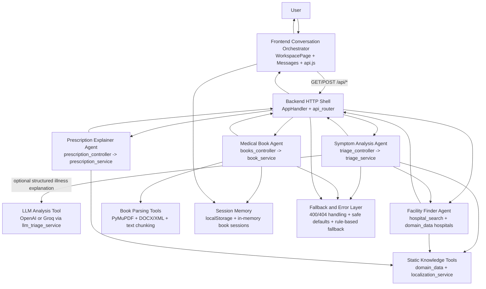

# Agent Architecture Overview

This document summarizes the current agent-style architecture inside GenAi Healthcare Assistant. It shows the major agent roles, how they communicate, what tools or data sources they use, and how the system handles failures safely.

## System Diagram

## Agent Roles

### 1. Frontend Conversation Orchestrator
The frontend acts as the top-level orchestrator for the user experience. It collects user intent from the chat composer, decides whether the request is a symptom analysis, prescription explanation, hospital search, or medical-book query, and calls the matching backend endpoint through `frontend/src/services/api.js`.

Responsibilities:
- Manage onboarding, language selection, session state, and chat history.
- Route user actions to the right backend tool.
- Render structured response cards for symptom analysis, prescriptions, facilities, and book answers.
- Surface backend failures as readable UI errors.

### 2. Symptom Analysis Agent
This is the main clinical reasoning path for the app. `POST /api/analyze` reaches `triage_controller`, then `triage_service`, which performs symptom detection, severity scoring, specialty inference, location-aware facility suggestions, and a structured explanation response.

Responsibilities:
- Detect symptoms from free text and selected chips.
- Infer urgency level and doctor type.
- Build a safe explanation response.
- Add nearby hospitals to the result.
- Use AI only as an enhancement layer, not as a single point of failure.

### 3. LLM Analysis Tool
The LLM layer is optional and is only used inside the symptom-analysis path. If `OPENAI_API_KEY`/`OPEN_API_KEY` or `GROQ_API_KEY` is configured, `llm_triage_service` sends a structured prompt to OpenAI or Groq and asks for JSON fields such as `possibleCondition`, `illnessExplanation`, `commonSymptoms`, `whenToSeekHelp`, and `followUpQuestion`.

Responsibilities:
- Refine illness explanation in the requested language.
- Preserve the app's safety format.
- Fall back silently if the provider is unavailable or the response is malformed.

### 4. Facility Finder Agent
This agent powers `GET /api/hospitals` and is also reused by the symptom-analysis path. It ranks hospitals from the local hospital dataset using district, state, specialty, and urgency.

Responsibilities:
- Resolve exact or mock location.
- Rank nearby facilities.
- Return facility type and distance labels.

### 5. Prescription Explainer Agent
`POST /api/prescription/explain` reaches `prescription_service`, which parses shorthand instructions such as `OD`, `BD`, `TDS`, `AC`, and `PC`, then converts them into human-readable schedules.

Responsibilities:
- Decode prescription abbreviations.
- Extract timing, meal relation, and duration.
- Return safety reminders instead of diagnosis advice.

### 6. Medical Book Agent
This agent powers `GET /api/books` and the `/api/books/*` mutation/query routes. It stores uploaded books per user session, extracts readable text, chunks it, checks whether the source seems trusted, and answers only from the uploaded text.

Responsibilities:
- Ingest PDF, DOCX, TXT, or pasted text.
- Detect verified vs cautionary sources.
- Require explicit confirmation for untrusted sources.
- Answer only from retrieved excerpts, with disclaimer and safety note.

## Communication Pattern

The communication pattern is hub-and-spoke:

1. The user speaks to one chat interface.
2. The frontend orchestrator decides which backend capability is needed.
3. The backend HTTP shell routes the request to a focused controller.
4. The controller delegates to a single service module.
5. The service may call supporting tools such as localization, hospital ranking, file parsing, or an external LLM.
6. The service returns structured JSON to the frontend.
7. The frontend renders the result as a chat message and keeps the conversation moving with follow-up prompts.

This keeps the UI simple while separating each specialist capability into its own tool-like path.

## Tool Integrations

The current tool integrations are:
- OpenAI or Groq chat completions for optional symptom explanation enhancement.
- Static medical/domain data in `domain_data.py` for symptoms, hospitals, facilities, and labels.
- `localization_service.py` for multilingual UI/response copy.
- PyMuPDF for PDF book extraction.
- DOCX/XML parsing through standard-library ZIP and XML utilities.
- Browser `fetch` plus `requestJson` error normalization on the frontend.
- Browser `localStorage` for cached bootstrap data and user-side conversation state.
- In-memory backend session storage for uploaded medical books.

## Error-Handling Logic

The system is designed so failure in one tool does not collapse the whole experience.

### Frontend error handling
- `requestJson` attempts to parse JSON first, then falls back to text.
- If the backend returns `{ "error": ... }`, that message is surfaced directly.
- If the backend returns a non-JSON failure, the frontend uses the HTTP status text as a fallback.

### Backend HTTP error handling
- Invalid or missing JSON payloads are normalized by `read_json`.
- `ValueError` raised by service logic becomes a `400 Bad Request` JSON response.
- Unknown routes return `404`.
- Static-file path traversal is blocked with `403 Forbidden`.

### Agent/service error handling
- Symptom analysis always has a rule-based path.
- If OpenAI or Groq is not configured, unavailable, or returns bad output, `triage_service` falls back to `analysisSource = rule_based`.
- Medical book uploads reject unreadable, oversized, or unsupported content with explicit user-facing errors.
- Untrusted book sources do not fail hard; they enter a confirmation flow.
- If a book answer is not found, the system says the information is not available in the uploaded text instead of hallucinating.
- Prescription parsing returns explanation and warnings, not medication instructions.

## Design Summary

In practice, your app behaves like a small multi-agent system behind one chat UI. The frontend is the orchestrator, each backend service behaves like a specialist agent, and optional external tools such as OpenAI, Groq, PyMuPDF, and the local medical-book retriever plug into those agents as needed. The key design choice is graceful degradation: when a premium tool or external provider fails, the system still responds with a safe structured result instead of leaving the user stuck.
